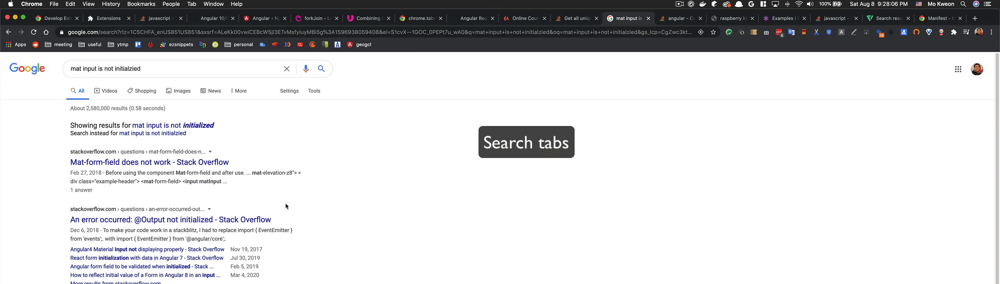

# Butler

Butler is a Chrome extension that provides a unified search interface for managing browser tabs, browsing history, and executing browser actions. Built with Angular 20 and Material Design, it helps power users efficiently navigate and organize their browsing sessions.

<div>
  
</div>

## Features

- **Tab Search**: Find and switch to open tabs using fuzzy search
- **History Search**: Search browser history with configurable date ranges
- **Browser Actions**: Execute common tab management operations
  - Close other tabs (excluding pinned tabs)
  - Close tabs to the right
  - Open extension settings
- **Configurable Options**: Customize search data sources (tabs, history, bookmarks)
- **Fuzzy Search**: Powered by Fuse.js for intelligent matching
- **Material Design**: Clean, responsive interface

## Installation

### From Chrome Web Store

Install Butler directly from the [Chrome Web Store](https://chrome.google.com/webstore/detail/haepoecmeobjjfeonmpphmpajaefcnfo).

### Local Development

1. Clone the repository: `git clone https://github.com/kkweon/butler.git`
2. Install dependencies: `yarn install`
3. Build the extension: `yarn build:prod`
4. Load the `dist/butler` folder as an unpacked extension in Chrome

## Usage

1. Click the Butler extension icon in your browser toolbar
2. Type to search across tabs, history, and browser actions
3. Use arrow keys to navigate results and Enter to select
4. Access settings through the "Open settings" action or right-click the extension icon

## Development

This project uses Angular 20 with a single project structure.

### Development Workflow

To develop and test the Butler extension locally, follow these steps:

1.  **Build and Watch:** Run `yarn build --watch` in your terminal. This command compiles the extension and watches for any file changes, rebuilding automatically.
    *   _Note for specific development setups:_ If you need to automatically update `manifest.json` with an extension key (e.g., for a consistent development ID or private key), use `yarn build:work --watch` instead. This requires the `EXTENSION_MANIFEST_JSON_KEY` environment variable to be set (typically in an `.env` file at the project root), which then triggers `scripts/update-manifest.sh` after each build.
2.  **Output Directory:** The compiled extension files will be located in the `dist/butler` folder.
3.  **Load Unpacked Extension:**
    *   Open Chrome and navigate to `chrome://extensions`.
    *   Enable "Developer mode" (usually a toggle in the top right corner).
    *   Click on "Load unpacked" and select the `dist/butler` folder.
4.  **Set Keyboard Shortcut (Recommended):**
    *   In `chrome://extensions/shortcuts`, find the Butler extension.
    *   Set a convenient keyboard shortcut (e.g., `Ctrl+K` or `Cmd+K`) to quickly open the extension popup.
5.  **Live Development:** With this setup, any changes you make to the source code will trigger a rebuild, and you can test the updated extension by simply reopening it (or by Chrome automatically reloading it, depending on the type of change).

This workflow allows for an efficient live development and testing cycle.

### Prerequisites

- Node.js 22+
- Yarn package manager

### Project Structure

```
butler/
├── src/                          # Main extension with popup and options views
│   ├── app/
│   │   ├── app.component.*       # Main popup interface
│   │   ├── options.component.*   # Settings/options interface
│   │   ├── container.component.ts # Routing container
│   │   └── chrome-shared-options.service.ts # Chrome storage utilities
│   ├── options.html             # Options page entry point
│   └── manifest.json            # Chrome extension manifest
```

### Development Commands

```bash
# Install dependencies
yarn install

# Start development server (for testing components)
yarn start

# Build the project
yarn build

# Build for production
yarn build:prod

# Run tests
yarn test

# Format code
yarn format

# Create distributable zip
yarn zip
```

### Architecture

- **Angular Project Structure** (`src/`): The extension is built as a single Angular CLI project. This project compiles into the necessary assets for the Chrome extension, including distinct HTML pages for the popup and options UI.
- **Popup View** (`index.html`): This is the default interface when clicking the extension icon. It provides the search functionality for tabs, history, and browser actions. It bootstraps the main Angular application components for the popup.
- **Options View** (`options.html`): This page is accessible via the browser's extension management page or a link/action within the extension. It allows users to configure search preferences. It bootstraps the Angular components specific to the options UI.
- **Build System**: The Angular CLI is configured (via `angular.json` and `custom-webpack.config.js`) to produce the main popup application (`index.html` and its JavaScript) and the options page application (`options.html` and its JavaScript) from a unified codebase.
- **CI/CD**: Automated testing (unit tests via Karma) and Chrome Web Store publishing are managed using GitHub Actions and semantic-release.

The extension utilizes separate HTML entry points (`index.html` for the popup, `options.html` for settings) as defined in `manifest.json`. Each entry point bootstraps its respective Angular components. This approach allows for a shared codebase (services, utilities, common components) within a single Angular project, while providing the distinct pages required by the Chrome extension architecture, rather than using client-side routing (like query parameters) to switch between these major UIs.

### Chrome Permissions

Butler requires the following permissions:

- `tabs`: Access and manage browser tabs
- `history`: Search browsing history
- `storage`: Save user preferences
- `windows`: Access and manage browser windows

## Contributing

1. Fork the repository
2. Create a feature branch: `git checkout -b feature/your-feature`
3. Make your changes and add tests
4. Run tests: `yarn test`
5. Format code: `yarn format`
6. Commit your changes: `git commit -m 'Add some feature'`
7. Push to the branch: `git push origin feature/your-feature`
8. Submit a pull request

### Development Notes

- The extension uses Chrome Extension Manifest V3
- Fuzzy search is implemented using Fuse.js
- UI components use Angular Material
- State management uses RxJS observables
- Chrome APIs are wrapped in Promise-based service layer

## License

This project is licensed under the MIT License.
